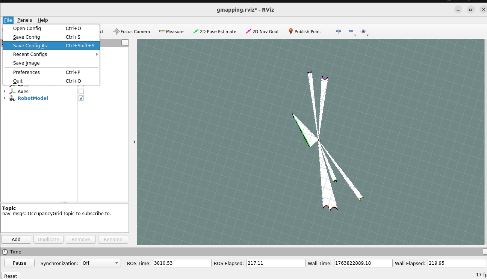

# Guidelines to run Simulation

## Steps to run Gazebo world and spawn the robot with its arm

1. Create your world file and save it in the path `pick_place/worlds/`
    - step 1:
    - step 2:
2. Copy the launch files:
    - `gazebo.launch` from [limo_cobot_sim/limo_cobot_moveit/launch/gazebo.launch](../limo_cobot_sim/limo_cobot_moveit/launch/gazebo.launch)
    - `world.launch` from [limo_cobot_sim/limo_cobot_moveit/launch/demo_gazebo.launch](../limo_cobot_sim/limo_cobot_moveit/launch/demo_gazebo.launch)

    into `pick_place/launch/` folder
3. Modify the `gazebo.launch` file:
    - For debugging, pass the `verbose` mode with a value: true
    ```
    <!-- Start Gazebo paused to allow the controllers to pickup the initial pose -->
    <include file="$(find gazebo_ros)/launch/empty_world.launch" pass_all_args="true">
        <arg name="paused" value="true"/>
        <arg name="verbose" value="true"/>
    </include>
    ```
    - Change any references to the `limo_cobot_sim` directories to look inside the package itself instead:
    e.g. in line `line 29`, change from:
        - `<include file="$(dirname)/ros_controllers.launch"/>`

        to:
        - `<include file="$(find limo_cobot_moveit)/launch/ros_controllers.launch"/>`
4. Modify the `world.launch` file:
    - Change any references to the `limo_cobot_sim` directories to look inside the package itself instead:
    e.g. in line `line 16`, change from:
        - `<include file="$(dirname)/demo.launch" pass_all_args="true">`

        to:
        - `<include file="$(find limo_cobot_moveit)/launch/demo.launch" pass_all_args="true">`
    - Modify the path where gazebo-ros package looks for gazebo worlds to be the path where you create your own gazebo world, and choose from the worlds you created:
    In `line`, change from:
        - `<arg name="world_name" default="worlds/empty.world" doc="Gazebo world file"/>`
        
        to, e.g.:
        - `<arg name="world_name" default="$(dirname)/../worlds/clearpath_playpen.world" doc="Gazebo world file"/>`
5. Run the `world.launch` file:
    ```bash
    $roslaunch pick_place world.launch
    ```

## Steps to run Gmapping node and generate the robot map

1. Copy Limo's predefined gmapping launch in [gmapping.launch](https://github.com/agilexrobotics/limo_ros/blob/master/limo_bringup/launch/limo_gmapping) into `pick_place/launch` folder
    - change the topic name for laser scan that gmapping uses (`/scan`) to match the name of topic for Limo (`/limo/scan`)
    *Hint: add the following tag in gmapping node:*
        `<remap from="/scan" to="/limo/scan" />`
2. Add Rviz node with your custom configurations:
    - disable rviz node from moveit launch:
    ```
    <include file="$(find limo_cobot_moveit)/launch/demo.launch" pass_all_args="true">
        <!-- robot_description is loaded by gazebo.launch, to enable Gazebo features -->
        <arg name="load_robot_description" value="false" />
        <arg name="moveit_controller_manager" value="ros_control" />
        <arg name="use_rviz" value="false"/>
    </include>
    ```
    - copy gmapping rviz configuration file from `limo_ros` in [gmapping.rviz](https://github.com/agilexrobotics/limo_ros/blob/master/limo_bringup/rviz/gmapping.rviz) into `pick_place/rviz` folder

3. Run the launch file for gmapping:
    - While `world.launch` is running, execute this:
        ```bash
        $roslaunch pick_place gmapping.launch
        ```
    - Modify your Rviz settings and then save to `gmapping.rviz`
        
    - Modify the default rviz configuration file that gmapping uses (`line 42`):
        ```<node pkg="rviz"  type="rviz"  name="rviz"  args="-d $(find pick_place)/rviz/gmapping.rviz" />```
    - Modify the map dimensions parameters `xmin, xmax, ymin, ymax`        to match your prefrences.
    - Then rerun the launch file
4. Run the teleop_keyboard launch:
    ```bash
    $rosrun teleop_twist_keyboard teleop_twist_keyboard.py 
    ```
5. steps to save a map.
   - Change the directory to maps folder:
         Run `cd /src/pick_place/maps/`
   - Install the [map_server pkg] (https://wiki.ros.org/map_server):
         Run `sudo apt install ros-noetic-map-server`
   - Save the map using the map_server pkg:
         Run `rosrun map_server map_saver -f cleanpath_map`

## steps to run the navigation:

1. Copy Limo's predefined limo_navigation_diff launch in  [limo_navigation_diff.launch](https://github.com/agilexrobotics/limo_ros/blob/master/limo_bringup/launch/limo_navigation_diff.launch) into `pick_place/launch` folder

2. Copy the parameter files from inside the [diff file] (https://github.com/agilexrobotics/limo_ros/tree/master/limo_bringup/launch)
   - remove the diff folder from the path in the limo_navigation_diff file to match our path.
   - replace the limo_bringup pkg with our pkg name pick_place in the limo_navigation_diff.launch file.
   - Copy Limo's predefined navigation_diff.rviz in [navigation_diff.rviz](https://github.com/agilexrobotics/limo_ros/blob/master/limo_bringup/rviz/navigation_diff.rviz) into `pick_place/rviz` folder
 
3. Run the launch file for navigation:
    - Add a map_server node to publish the map constructed by gmapping
        ```bash
        <arg name="map_file" default="$(find pick_place)/maps/clearpath_map.yaml"/>
        <node pkg="map_server" name="map_server" type="map_server" args="$(arg map_file)"/>
        ```
    - Run `rosrun world.launch`
    - inside the limo_navigation_diff.launch add the following tag in 
        * amcl node:
            
            `<remap from="/scan" to="/limo/scan" />`
        * move_base node:
            
            `<remap from="/scan" to="/limo/scan" />`
    - run `roslaunch pick_place navigation.launch`
    - install the ros-noetic-amcl pckg using `sudo apt install ros-noetic-amcl`
    - install the ros-noetic-move-base pckg using `sudo apt install ros-noetic-move-base`
    - install the ros-noetic-global-planner pckg using `sudo apt install ros-noetic-global-planner`
